# 1.云服务器中安装宝塔脚本
安装命令：
```c
wget -O bt_ubuntu_deepin.sh http://filedown.myhostadmin.net/bt/ubuntu_deepin.sh && sudo bash bt_ubuntu_deepin.sh
```
安装结果：
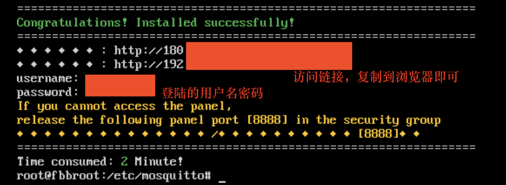

# 2.通过宝塔页面安装Docker管理器
操作如下：
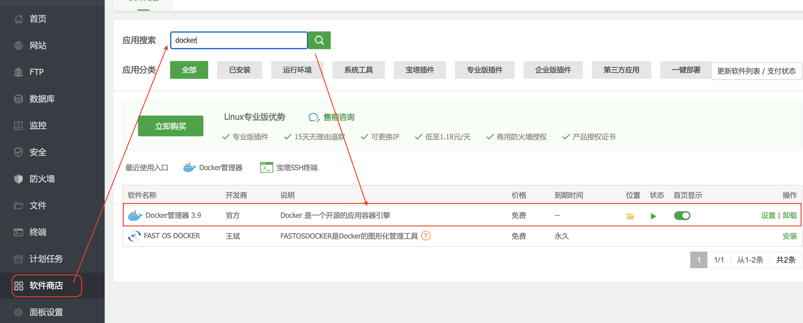
# 3.拉取MQTT相关镜像到Docker中
操作如下：

1.打开Docker管理器
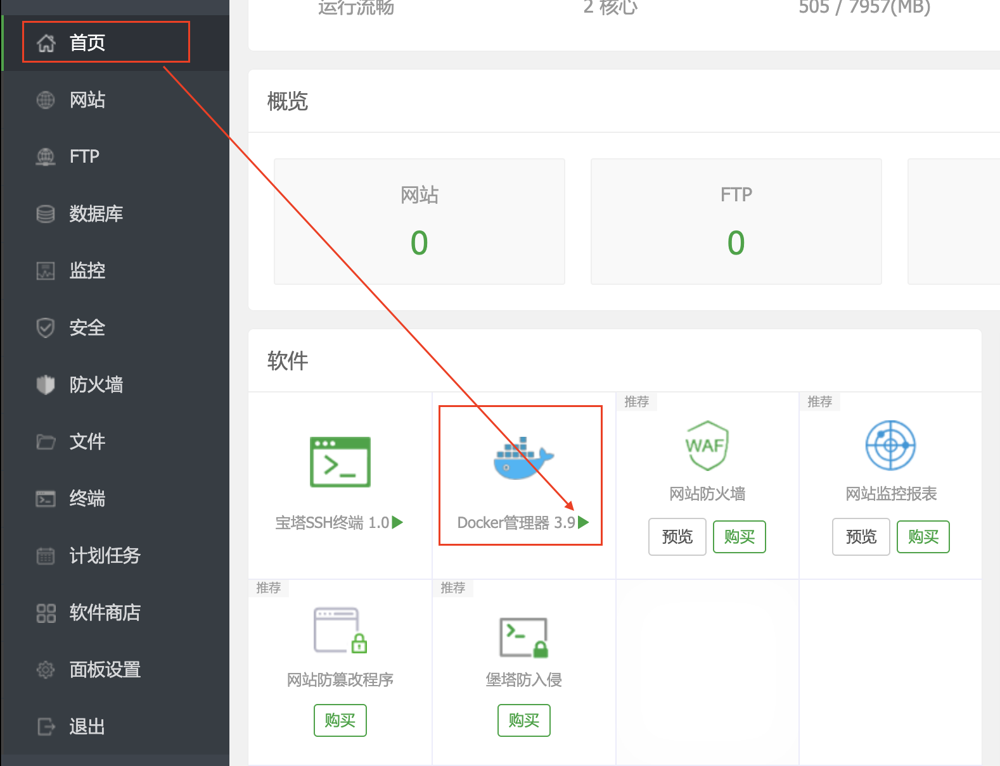

2.拉取``` emqx/emqx ```镜像
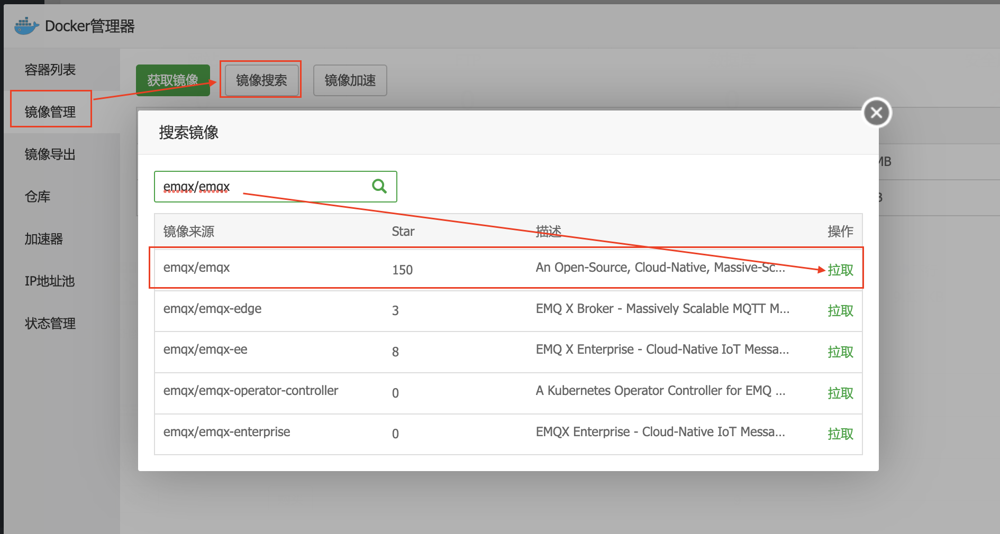
# 4.开启MQTT服务
(1).首先打开终端
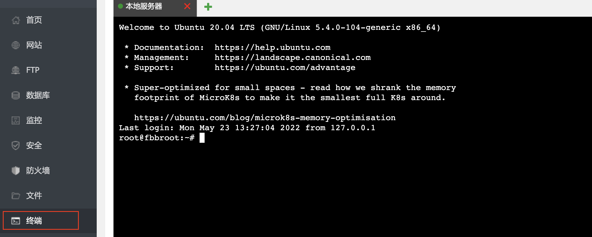

(2).分别输入命令
```c
docker run -dit --name emqx -p 18083:18083 -p 1883:1883 -p 8083:8083 -p 8084:8084 emqx/emqx:latest

```

```c
docker exec -it  emqx /bin/sh
```
## 随后，可访问emqt的Web访问页面

链接：``` http://0.0.0.0:18083 ``` (0.0.0.0自行替换为自己公网IP)

默认账号：```admin```

默认密码：```public```

登陆成功页面：

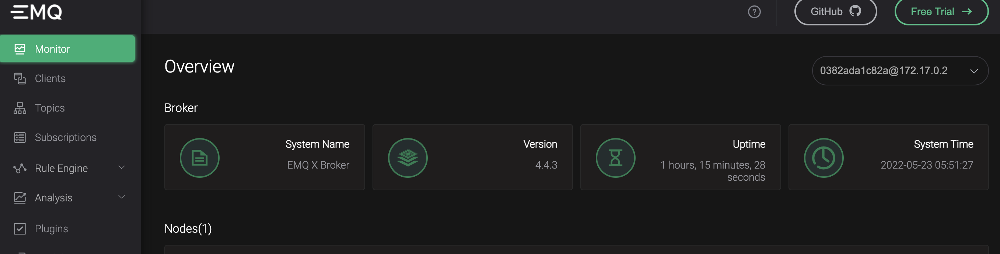
# 测试
## 1. Python测试
首先安装paho-mqtt

命令安装：
```c 
pip install paho-mqtt
```
使用Pycharm安装：
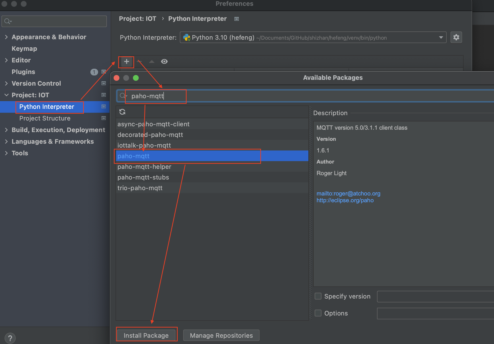

### 数据发送代码
```python
from paho.mqtt import client as mqtt_client
import random
import time

broker = '0.0.0.0'  #云服务器公网IP
port = 1883  #MQTT协议端口
topic = "testtopic"  #发送与接收端topic需保持一致

#调用 Python random.randint 函数随机生成 MQTT 客户端 id
client_id = f'python-mqtt-{random.randint(0, 1000)}'

def connect_mqtt():
    def on_connect(client, userdata, flags, rc):
        if rc == 0:
            print("Connected to MQTT Broker!")
        else:
            print("Failed to connect, return code %d\n", rc)
    client = mqtt_client.Client(client_id)
    client.on_connect = on_connect
    client.connect(broker, port)
    return client

def publish(client):
    msg_count = 0
    while True:
        time.sleep(1)
        msg = f"messages: {msg_count}"
        result = client.publish(topic, msg)
        # result: [0, 1]
        status = result[0]
        if status == 0:
            print(f"Send `{msg}` to topic `{topic}`")
        else:
            print(f"Failed to send message to topic {topic}")
        msg_count += 1

def run():
    client = connect_mqtt()
    client.loop_start()
    publish(client)

if __name__ == '__main__':
    run()

```
### 接收端代码
```python
from paho.mqtt import client as mqtt_client
import random

broker = '0.0.0.0' #云服务器公网IP,与发送端一致
port = 1883   #MQTT 协议端口
topic = "testtopic"  #与发送端一致

# 调用 Python random.randint 函数随机生成 MQTT 客户端 id
client_id = f'python-mqtt-{random.randint(0, 1000)}'

def connect_mqtt() -> mqtt_client:
    def on_connect(client, userdata, flags, rc):
        if rc == 0:
            print("Connected to MQTT Broker!")
        else:
            print("Failed to connect, return code %d\n", rc)

    client = mqtt_client.Client(client_id)
    client.on_connect = on_connect
    client.connect(broker, port)
    return client

def subscribe(client: mqtt_client):
    def on_message(client, userdata, msg):
        print(f"Received `{msg.payload.decode()}` from `{msg.topic}` topic")

    client.subscribe(topic)
    client.on_message = on_message

def run():
    client = connect_mqtt()
    subscribe(client)
    client.loop_forever()

if __name__ == '__main__':
    run()
```
测试结果如下：

发送数据
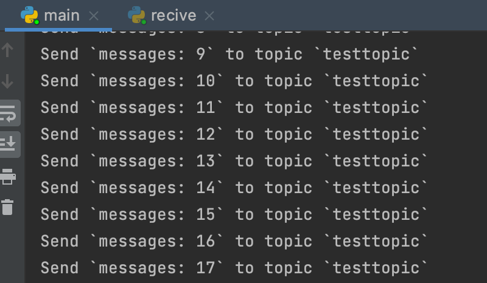

接收数据
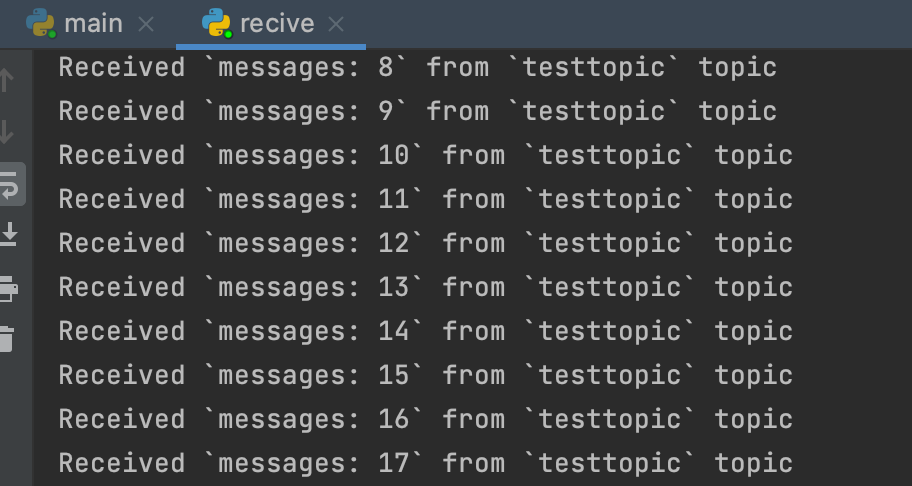
## 2.Python+MQ
 首先进行MQ连接
 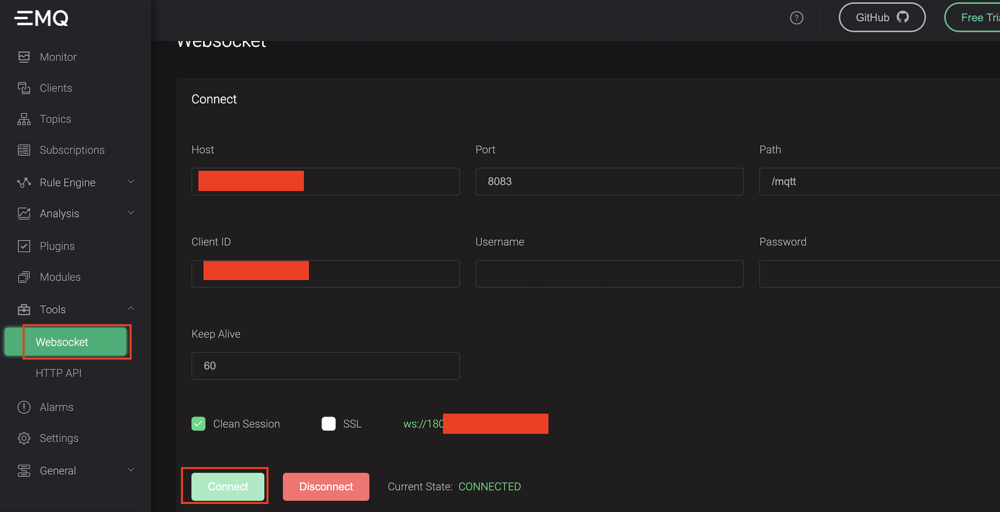

### (1).python发送数据；MQ接收数据
 


连接成功后，进行接收相关配置（上面操作页面下滑）
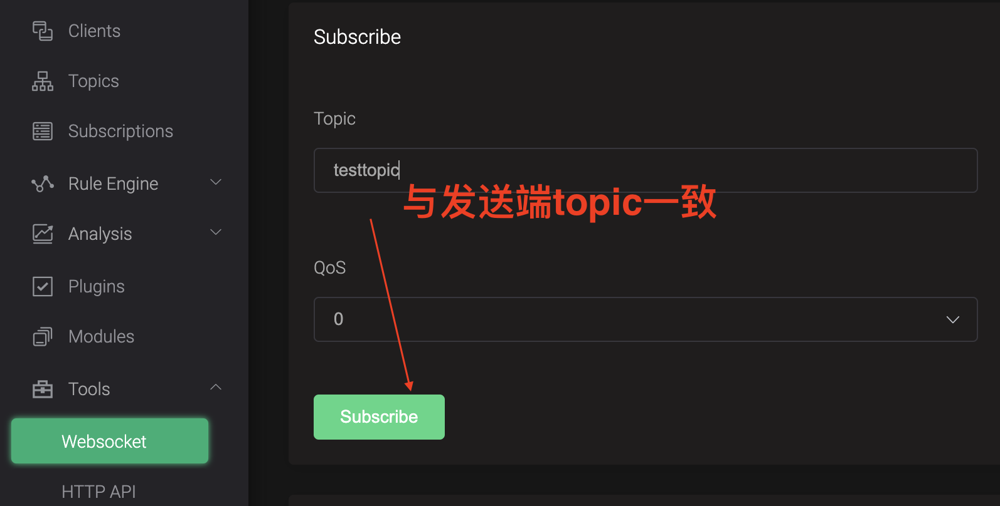

设置完成后，运行之前的Python发送数据代码，滑到MQ页面底部可看到接收的数据
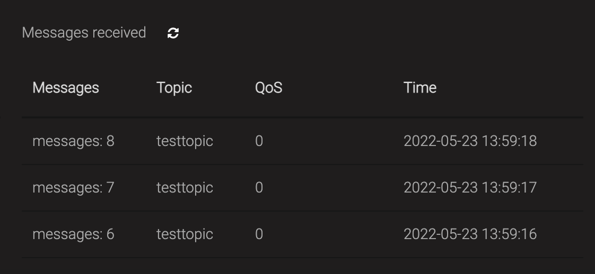

### (2).Python接收数据；MQ发送数据
首先运行python接收数据的代码。

MQ页面中进行如下操作：
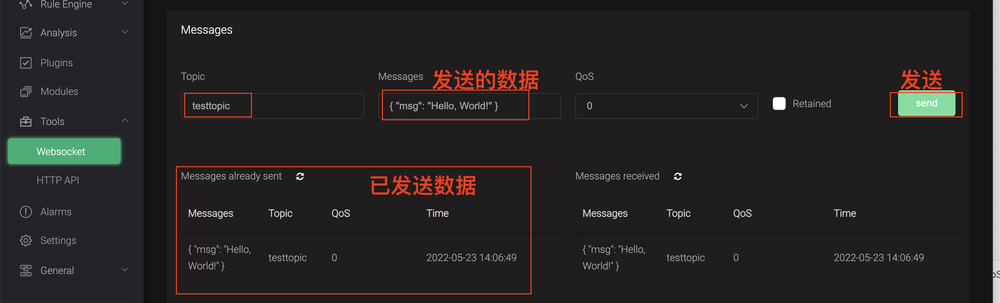

验证Python端接收的数据：
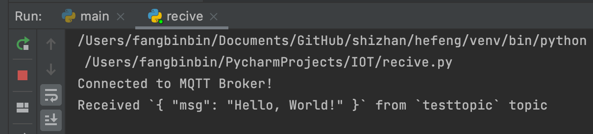

----
**验证完毕，MQTT搭建成功！**

